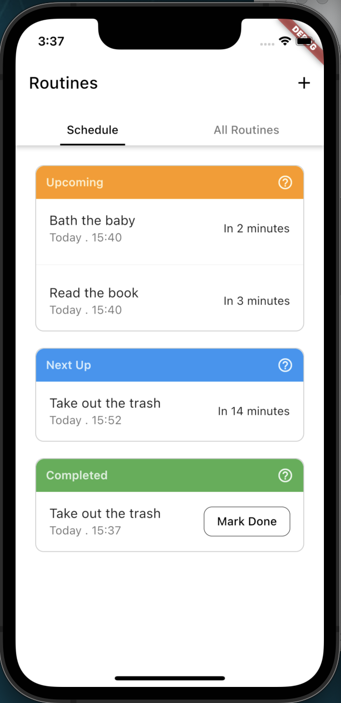
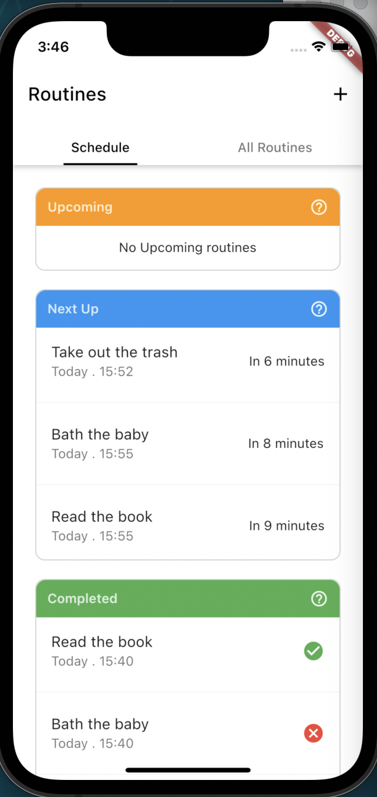
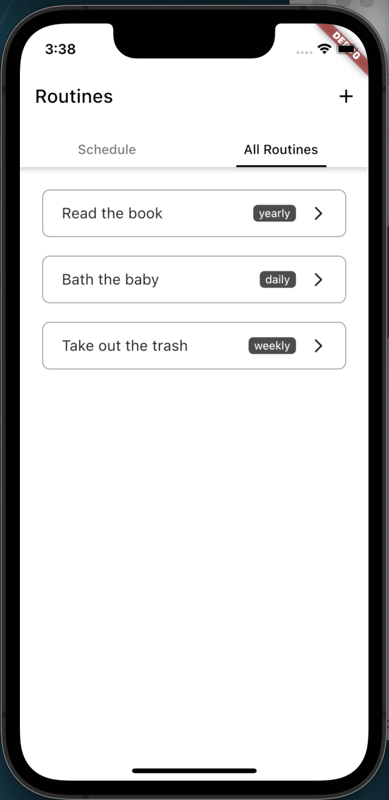
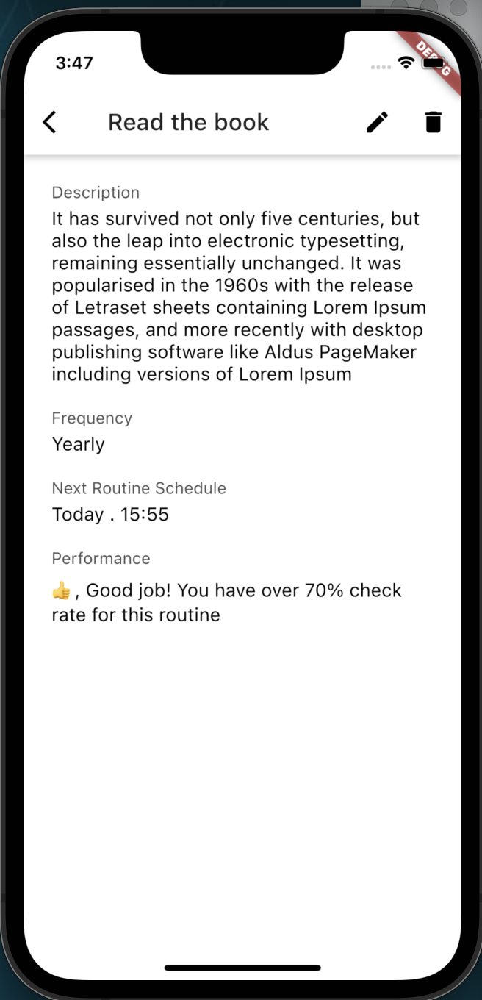
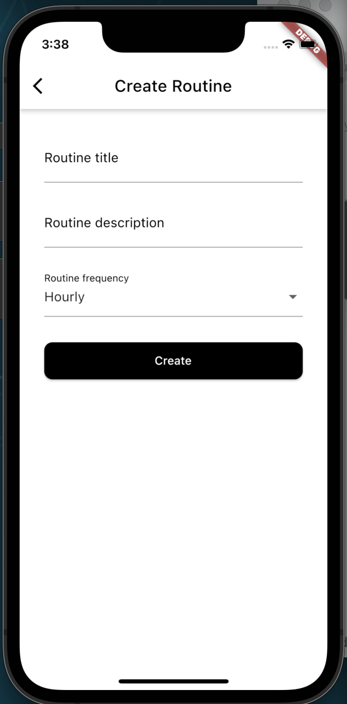

# Routine Check

This project covers the case study of a routine check mobile application.  
## Preview
 

 

## Further Improvements

Having been developed with simplicity in mind, this project only offers periodic updates every minute to ensure routines are continously updated, while the app is in the foreground or background, not terminated. This project can be further improved to provide notification reports when routine checks are due even when the application is terminated.

## Getting Started

This project is a starting point for a Flutter application.

A few resources to get you started if this is your first Flutter project:

- [Lab: Write your first Flutter app](https://docs.flutter.dev/get-started/codelab)
- [Cookbook: Useful Flutter samples](https://docs.flutter.dev/cookbook)

For help getting started with Flutter development, view the
[online documentation](https://docs.flutter.dev/), which offers tutorials,
samples, guidance on mobile development, and a full API reference.
